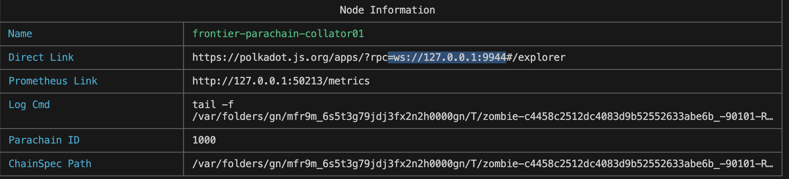
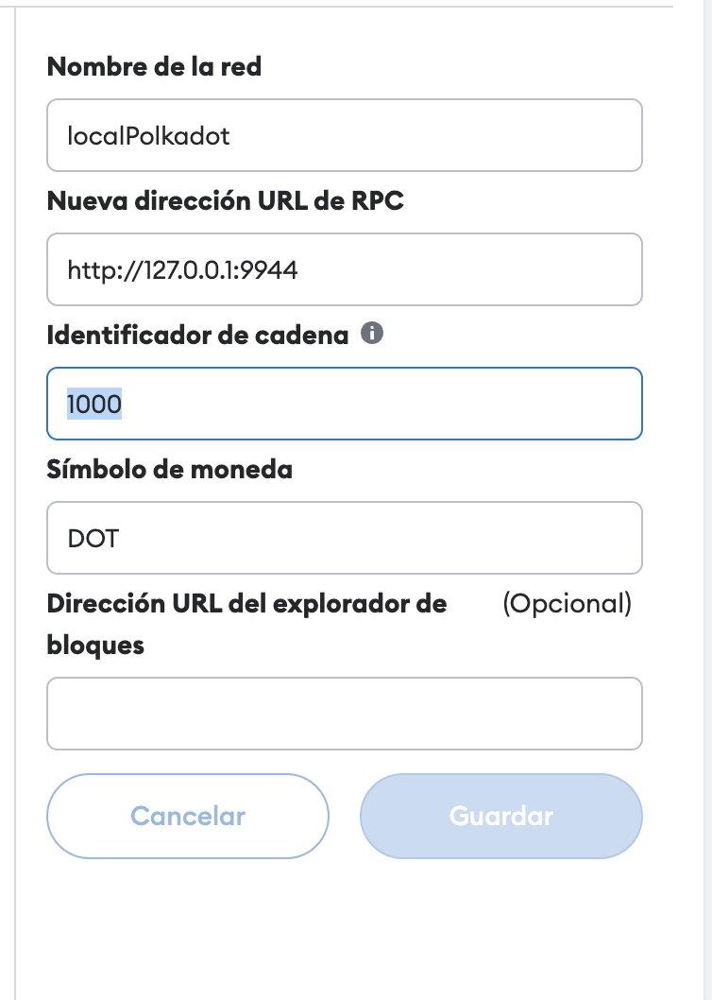
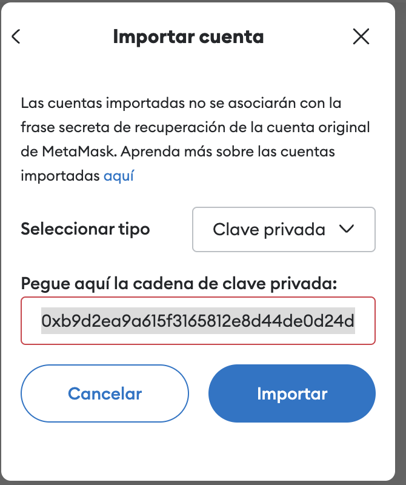
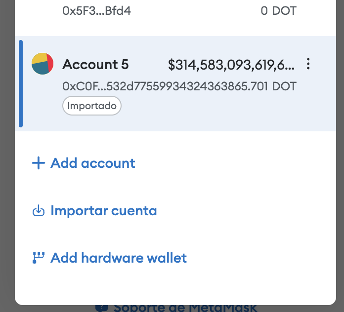
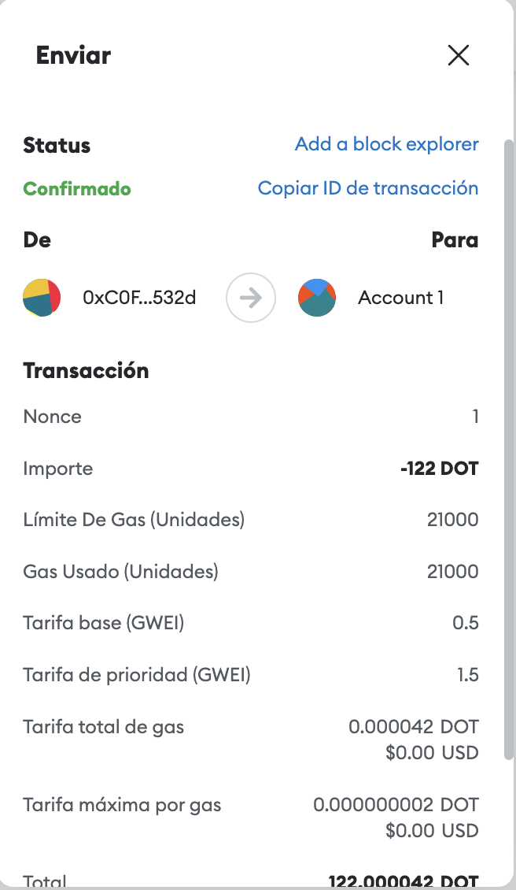
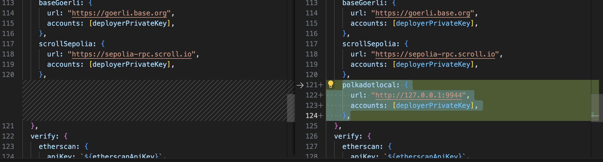
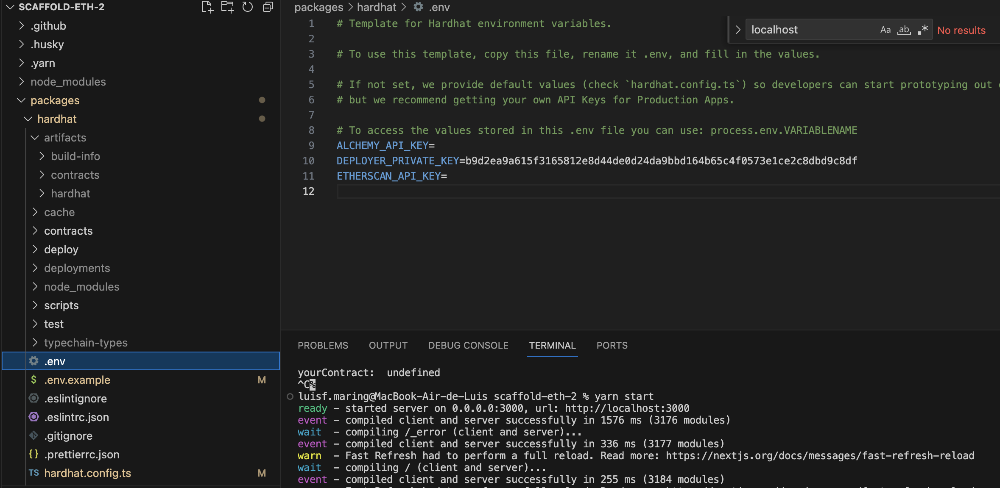
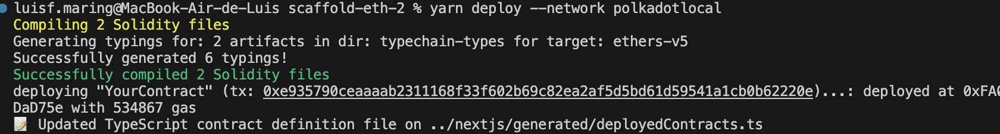
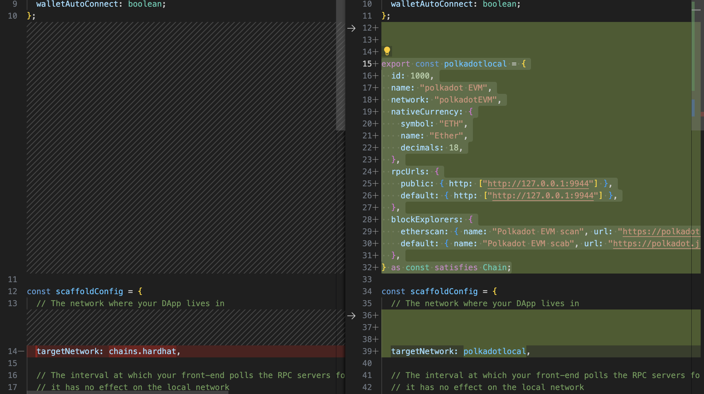

### Prerequisits for the workshop
1. Install Rust toolchain: [Guide](https://docs.substrate.io/install/rust-toolchain/) 

2. Install Solang, the Solidity compiler to WASM: [Installing Solang](https://solang.readthedocs.io/en/v0.3.2/installing.html)

2. Clone the repository for this workshop:
`git clone https://github.com/AlexD10S/ETH-Workshop`

    That's basically a fork of the [Frontier Parachain Template](https://github.com/paritytech/frontier-parachain-template), which is a ready-to-use EVM-based parachain (based on the Frontier project), where I have added the pallet-contracts.


### Set up the environment
Set up the testing environment with Zombienet. [Zombienet](https://github.com/paritytech/zombienet) is a tool to easily spawn ephemeral Polkadot/Substrate networks and perform tests against them.

You can download executables of the Zombienet CLI from [paritytech/zombienet/releases](https://github.com/paritytech/zombienet/releases)


- Download the Zombienet CLI according to your operating system.

 💡 Tip: If you want the executable to be available system-wide then make sure you place it in one of your `$PATH` directories.
```sh
wget https://github.com/paritytech/zombienet/releases/download/v1.3.69/zombienet-macos
chmod +x zombienet-macos 
cp zombienet-macos /usr/local/bin
```
Then invoke it anywhere like :
```sh 
zombienet-macos --help
```

For our tutorial we are going to start a Relay Chain (Polkadot) and our Parachain, for that we have to generate the binaries:

In our repository:
```sh 
mkdir bin
```

Now we will build the Polkadot binary. If you’re setting up the test network on Linux, you can download the Polkadot binary from [Releases](https://github.com/paritytech/polkadot/releases) into your working folder. If you’re setting up the test network on macOS or want to compile the binary yourself, continue to the next step.
```sh 
git clone --branch release-v1.0.0 https://github.com/paritytech/polkadot.git

cd polkadot

cargo build --release
```

We take the binary `./target/release/polkadot` and paste it in the bin folder of our repository.

Now you can use Zombienet to run our testing network, in our repository run:
```sh 
zombienet-macos spawn zombienet-config.toml -p native
```

Well done you have a parachain running! 🍻🍻
You can see your parachain on:
https://polkadot.js.org/apps/?rpc=ws://127.0.0.1:9944#/explorer 

And the Relay chain here: https://polkadot.js.org/apps/?rpc=ws://127.0.0.1:9900#/explorer 

### Config metamask rpc

Node information parachain



RPC : http://127.0.0.1:9944
ID : 1000




### Import account alice metamask


You can find the seed phrase for Alice's account in the ERC-20 workshop example: [ERC-20 Workshop Example](https://github.com/AlexD10S/ETH-Workshop/blob/fdcbe7624c4db34f1b9c9973f800e5a23c9efaf5/examples/contract-erc20/create-erc20-rpc.ts#L9)

Seed Phrase: 0xb9d2ea9a615f3165812e8d44de0d24da9bbd164b65c4f0573e1ce2c8dbd9c8df






At this point, you can send cryptocurrencies to other accounts.



### Config parachain on scaffold-eth-2

## Requirements

Before you begin, you need to install the following tools:

- [Node (v18 LTS)](https://nodejs.org/en/download/)
- Yarn ([v1](https://classic.yarnpkg.com/en/docs/install/) or [v2+](https://yarnpkg.com/getting-started/install))
- [Git](https://git-scm.com/downloads)

## Quickstart

To get started with Scaffold-ETH 2, follow the steps below:

1. Clone this repo & install dependencies

```
git clone https://github.com/scaffold-eth/scaffold-eth-2.git
cd scaffold-eth-2
yarn install
```

## add network on hardhat

In the file packages/hardhat/hardhat.config.ts add network local
```
polkadotlocal: {
    url: "http://127.0.0.1:9944",
    accounts: [deployerPrivateKey],
},
```



Create the .env file from .env.example and configure Alice's private key:

`DEPLOYER_PRIVATE_KEY=b9d2ea9a615f3165812e8d44de0d24da9bbd164b65c4f0573e1ce2c8dbd9c8df`




execute `yarn deploy --network polkadotlocal`



## add network on nextjs

in the file packages/nextjs/scaffold.config.ts add customn network

```
export const polkadotlocal = {
  id: 1000,
  name: "polkadot EVM",
  network: "polkadotEVM",
  nativeCurrency: {
    symbol: "ETH",
    name: "Ether",
    decimals: 18,
  },
  rpcUrls: {
    public: { http: ["http://127.0.0.1:9944"] },
    default: { http: ["http://127.0.0.1:9944"] },
  },
  blockExplorers: {
    etherscan: { name: "Polkadot EVM scan", url: "https://polkadot.js.org/apps/?rpc=ws://127.0.0.1:9944#/explorer" },
    default: { name: "Polkadot EVM scab", url: "https://polkadot.js.org/apps/?rpc=ws://127.0.0.1:9944#/explorer" },
  },
} as const satisfies Chain;

```

and modify targetNetwork with the new


